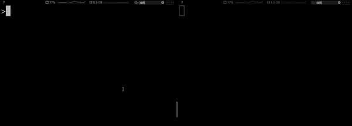

# Java演练

像所有出色的软件介绍一样，本演练将从头开始进行介绍。应用程序将运行一个简单的函数，函数接受请求并以问候语响应。它不会尝试涵盖应用程序开发的所有复杂性，而将重点放在构建有状态功能上-你将在其中实现业务逻辑。

## 一个基础的Hello

问候动作由使用ProtoBuf定义的消息的消费、路由和传递触发。

```text
syntax = "proto3";

message GreetRequest {
    string who = 1;
}

message GreetResponse {
    string who = 1;
    string greeting = 2;
}
```

 在底层，根据[状态函数](https://ci.apache.org/projects/flink/flink-statefun-docs-release-2.0/sdk/java.html)定义任何实现`StatefulFunction`接口的类，使用[状态函数](https://ci.apache.org/projects/flink/flink-statefun-docs-release-2.0/sdk/java.html)处理消息。

```text
package org.apache.flink.statefun.examples.greeter;

import org.apache.flink.statefun.sdk.Context;
import org.apache.flink.statefun.sdk.StatefulFunction;

public final class GreetFunction implements StatefulFunction {

    @Override
    public void invoke(Context context, Object input) {
        GreetRequest greetMessage = (GreetRequest) input;

        GreetResponse response = GreetResponse.newBuilder()
            .setWho(greetMessage.getWho())
            .setGreeting("Hello " + greetMessage.getWho())
            .build();

        context.send(GreetingConstants.GREETING_EGRESS_ID, response);
    }
}
```

函数接收请求并向外部系统\(或出口\)发送响应。虽然这很好，但它并没有显示有状态函数的真正威力:处理状态。

## 一个带状态的Hello

假设你要根据每个用户发送请求的次数为每个用户生成个性化响应。

```text
private static String greetText(String name, int seen) {
    switch (seen) {
        case 0:
            return String.format("Hello %s !", name);
        case 1:
            return String.format("Hello again %s !", name);
        case 2:
            return String.format("Third times the charm! %s!", name);
        case 3:
            return String.format("Happy to see you once again %s !", name);
        default:
            return String.format("Hello at the %d-th time %s", seen + 1, name);
}
```

## 消息路由

为了向用户发送个性化的问候，系统需要跟踪到目前为止每个用户已经看到了多少次。一般来说，最简单的解决方案是为每个用户创建一个函数，并独立跟踪用户被访问的次数。使用大多数框架，代价都非常昂贵的。但是，有状态函数是虚拟的，在不主动调用时不消耗任何CPU或内存。这意味着您的应用程序可以根据需要创建任意多的函数\(在本例中是用户\)，而无需担心资源消耗。

 每当从外部系统（或[ingress](https://ci.apache.org/projects/flink/flink-statefun-docs-release-2.0/io-module/index.html#ingress)）消耗数据时，都会根据给定的函数类型和标识符将其路由到特定函数。函数类型表示要调用的函数的类，例如Greeter函数，而标识符（`GreetRequest#getWho`）根据某个键将调用的作用域限定为特定的虚拟实例。

```text
package org.apache.flink.statefun.examples.greeter;

import org.apache.flink.statefun.examples.kafka.generated.GreetRequest;
import org.apache.flink.statefun.sdk.io.Router;

final class GreetRouter implements Router<GreetRequest> {

    @Override
    public void route(GreetRequest message, Downstream<GreetRequest> downstream) {
        downstream.forward(GreetingConstants.GREETER_FUNCTION_TYPE, message.getWho(), message);
    }
}
```

因此，如果有一个名为John的用户的消息进入，它将被发送到John的专用Greeter函数。如果有一个名为Jane的用户消息进入，则将产生Greeter函数的新实例。

## 持久化

 [持久化值](https://ci.apache.org/projects/flink/flink-statefun-docs-release-2.0/sdk/java.html#persistence)是一种特殊的数据类型，它支持有状态函数维护其标识符范围内的容错状态，以便函数的每个实例都可以独立地跟踪状态。要跨多个问候消息“记住”信息，然后需要将一个持久值字段\(count\)关联到Greet函数。对于每个用户，函数现在可以跟踪他们被查看了多少次。

```text
package org.apache.flink.statefun.examples.greeter;

import org.apache.flink.statefun.sdk.Context;
import org.apache.flink.statefun.sdk.StatefulFunction;
import org.apache.flink.statefun.sdk.annotations.Persisted;
import org.apache.flink.statefun.sdk.state.PersistedValue;

public final class GreetFunction implements StatefulFunction {

    @Persisted
    private final PersistedValue<Integer> count = PersistedValue.of("count", Integer.class);

    @Override
    public void invoke(Context context, Object input) {
        GreetRequest greetMessage = (GreetRequest) input;

        GreetResponse response = computePersonalizedGreeting(greetMessage);

        context.send(GreetingConstants.GREETING_EGRESS_ID, response);
    }

    private GreetResponse computePersonalizedGreeting(GreetRequest greetMessage) {
        final String name = greetMessage.getWho();
        final int seen = count.getOrDefault(0);
        count.set(seen + 1);

        String greeting = greetText(name, seen);

        return GreetResponse.newBuilder()
            .setWho(name)
            .setGreeting(greeting)
            .build();
    }
}
```

每次处理消息时，函数都会为该用户计算个性化消息。读取并更新已看到用户的次数，并向出口发送问候语。

 你可以在[此处查看](https://github.com/apache/flink-statefun/tree/release-2.0/statefun-examples/statefun-greeter-example)本演练中描述的应用程序的完整代码。特别要看的是模块`GreetingModule`（它是整个应用程序的主要入口点），以了解所有内容如何捆绑在一起。可以使用提供的Docker设置在本地运行此示例。

```text
$ docker-compose build 
$ docker-compose up
```

然后，发送一些消息到Topic “names”，并观察“greetings”输出了什么。

```text
$ docker-compose exec kafka-broker kafka-console-producer.sh \
    --broker-list localhost:9092 \
    --topic names

docker-compose exec kafka-broker kafka-console-consumer.sh \
     --bootstrap-server localhost:9092 \
     --isolation-level read_committed \
     --from-beginning \
     --topic greetings
```



## 想走得更远吗？

这个问候者永远不会忘记一个用户。 尝试并修改该功能，以便它将花费超过60秒而不与系统交互的任何用户重置计数。

